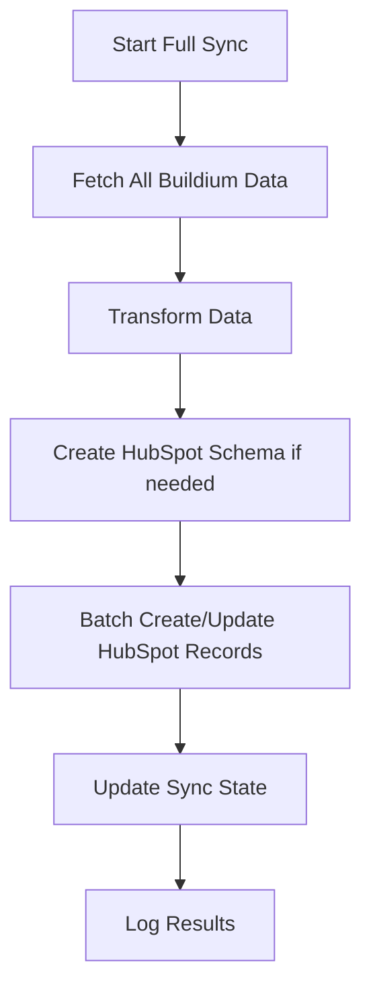
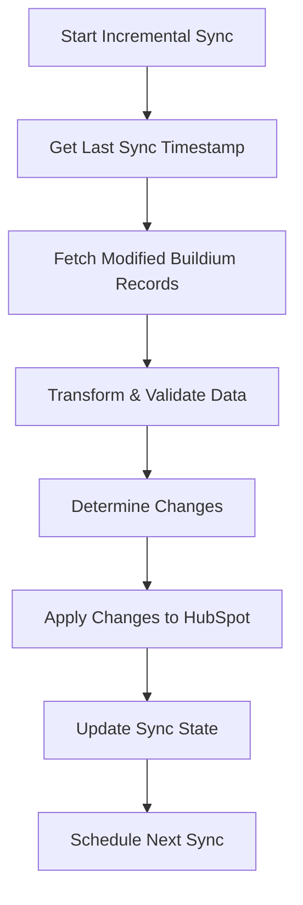

# Data Integration Plan: Buildium to HubSpot

## Project Overview

This plan outlines the strategy for integrating data from Buildium property management system into HubSpot CRM, following industry best practices for data synchronization, error handling, and scalability.

---

## 1. Data Mapping Strategy

### 1.1 Primary Data Entities

#### **Buildium → HubSpot Mapping**

| Buildium Entity | HubSpot Entity | Relationship Type |
|----------------|----------------|-------------------|
| Tenant | Contact | 1:1 Primary |
| Property | Native Listings Object (0-420) | 1:Many with Units |
| Unit | Custom Object (Unit) | Many:1 with Listings, 1:Many with Contacts |
| Lease | Association | Links Contact to Unit |
| Emergency Contact | Contact | Associated with Primary Contact |

### 1.2 Field Mapping

#### **Tenant → Contact Mapping**
```json
{
  "buildium_field": "hubspot_field",
  "Id": "buildium_tenant_id",
  "FirstName": "firstname",
  "LastName": "lastname", 
  "Email": "email",
  "AlternateEmail": "hs_additional_emails",
  "PhoneNumbers[0].Number": "phone",
  "DateOfBirth": "date_of_birth",
  "Address.AddressLine1": "address",
  "Address.City": "city",
  "Address.State": "state",
  "Address.PostalCode": "zip",
  "TaxId": "tax_id",
  "CreatedDateTime": "createdate",
  "Comment": "notes_last_contacted"
}
```

#### **Property → Native Listings Object (0-420) Mapping**
```json
{
  "Id": "buildium_property_id",
  "Name": "name",
  "Address": "address", 
  "NumberUnits": "total_units",
  "YearBuilt": "year_built",
  "StructureDescription": "property_type",
  "Features": "amenities",
  "MarketRent": "base_rent_amount",
  "Description": "description"
}
```

#### **Unit → Custom Object Mapping**
```json
{
  "Id": "buildium_unit_id",
  "PropertyId": "listing_id",
  "UnitNumber": "unit_number",
  "UnitBedrooms": "bedrooms",
  "UnitBathrooms": "bathrooms",
  "UnitSize": "square_feet",
  "MarketRent": "market_rent",
  "Description": "unit_description",
  "IsUnitOccupied": "occupancy_status",
  "IsUnitListed": "listing_status"
}
```

---

## 2. Architecture Design

### 2.1 System Components

```
┌─────────────────┐    ┌─────────────────┐    ┌─────────────────┐
│   Buildium API  │───▶│  Data Processor │───▶│   HubSpot API   │
└─────────────────┘    └─────────────────┘    └─────────────────┘
                              │
                              ▼
                    ┌─────────────────┐
                    │   Database      │
                    │   (Sync State)  │
                    └─────────────────┘
```

### 2.2 Technology Stack

#### **Core Application**
- **Language**: Node.js/TypeScript (for async processing)
- **Framework**: Express.js (for webhook endpoints)
- **Database**: PostgreSQL (for sync state and audit logs)
- **Queue**: Redis/Bull (for background job processing)
- **Logging**: Winston + structured logging
- **Monitoring**: Application Insights or similar

#### **Infrastructure**
- **Hosting**: Azure Functions or AWS Lambda (serverless)
- **Storage**: Azure Blob Storage or AWS S3 (for large payloads)
- **Secrets**: Azure Key Vault or AWS Secrets Manager

---

## 3. Data Flow Architecture

### 3.1 Sync Strategies

#### **Full Sync (Initial Load)**


#### **Incremental Sync (Ongoing)**


### 3.2 Processing Pipeline

#### **Stage 1: Data Extraction**
```typescript
interface ExtractionConfig {
  endpoint: string;
  lastSyncTime?: Date;
  batchSize: number;
  retryAttempts: number;
}

class BuildiumExtractor {
  async extractTenants(config: ExtractionConfig): Promise<Tenant[]>
  async extractProperties(config: ExtractionConfig): Promise<Property[]>
  async extractUnits(config: ExtractionConfig): Promise<Unit[]>
  async extractLeases(config: ExtractionConfig): Promise<Lease[]>
}
```

#### **Stage 2: Data Transformation**
```typescript
interface TransformationResult {
  contacts: HubSpotContact[];
  listings: HubSpotListing[];
  units: HubSpotCustomObject[];
  associations: HubSpotAssociation[];
  errors: TransformationError[];
}

class DataTransformer {
  async transformTenantToContact(tenant: BuildiumTenant): Promise<HubSpotContact>
  async transformPropertyToListing(property: BuildiumProperty): Promise<HubSpotListing>
  async transformUnitToCustomObject(unit: BuildiumUnit): Promise<HubSpotCustomObject>
  async createAssociations(leases: BuildiumLease[]): Promise<HubSpotAssociation[]>
}
```

#### **Stage 3: Data Loading**
```typescript
class HubSpotLoader {
  async batchCreateContacts(contacts: HubSpotContact[]): Promise<BatchResult>
  async batchCreateListings(listings: HubSpotListing[]): Promise<BatchResult>
  async batchCreateCustomObjects(objects: HubSpotCustomObject[], objectType: string): Promise<BatchResult>
  async createAssociations(associations: HubSpotAssociation[]): Promise<BatchResult>
  async handleConflicts(conflicts: ConflictRecord[]): Promise<ResolutionResult>
}
```

---

## 4. Database Schema Design

### 4.1 Sync State Tables

```sql
-- Sync job tracking
CREATE TABLE sync_jobs (
    id UUID PRIMARY KEY DEFAULT gen_random_uuid(),
    job_type VARCHAR(50) NOT NULL, -- 'full_sync', 'incremental_sync'
    status VARCHAR(20) NOT NULL, -- 'pending', 'running', 'completed', 'failed'
    started_at TIMESTAMP WITH TIME ZONE DEFAULT NOW(),
    completed_at TIMESTAMP WITH TIME ZONE,
    last_sync_time TIMESTAMP WITH TIME ZONE,
    records_processed INTEGER DEFAULT 0,
    records_created INTEGER DEFAULT 0,
    records_updated INTEGER DEFAULT 0,
    records_failed INTEGER DEFAULT 0,
    error_message TEXT,
    metadata JSONB
);

-- Entity mapping table
CREATE TABLE entity_mappings (
    id UUID PRIMARY KEY DEFAULT gen_random_uuid(),
    buildium_id VARCHAR(100) NOT NULL,
    buildium_type VARCHAR(50) NOT NULL, -- 'tenant', 'property', 'unit', 'lease'
    hubspot_id VARCHAR(100) NOT NULL,
    hubspot_type VARCHAR(50) NOT NULL, -- 'contact', 'property', 'unit'
    last_synced TIMESTAMP WITH TIME ZONE DEFAULT NOW(),
    sync_hash VARCHAR(64), -- For change detection
    created_at TIMESTAMP WITH TIME ZONE DEFAULT NOW(),
    updated_at TIMESTAMP WITH TIME ZONE DEFAULT NOW(),
    
    UNIQUE(buildium_id, buildium_type),
    INDEX(hubspot_id, hubspot_type),
    INDEX(last_synced)
);

-- Error tracking
CREATE TABLE sync_errors (
    id UUID PRIMARY KEY DEFAULT gen_random_uuid(),
    job_id UUID REFERENCES sync_jobs(id),
    buildium_id VARCHAR(100),
    buildium_type VARCHAR(50),
    error_type VARCHAR(100), -- 'validation_error', 'api_error', 'mapping_error'
    error_message TEXT,
    error_details JSONB,
    retry_count INTEGER DEFAULT 0,
    resolved BOOLEAN DEFAULT FALSE,
    created_at TIMESTAMP WITH TIME ZONE DEFAULT NOW()
);

-- Audit log
CREATE TABLE sync_audit (
    id UUID PRIMARY KEY DEFAULT gen_random_uuid(),
    job_id UUID REFERENCES sync_jobs(id),
    entity_type VARCHAR(50),
    entity_id VARCHAR(100),
    action VARCHAR(50), -- 'create', 'update', 'delete', 'skip'
    changes JSONB, -- What changed
    created_at TIMESTAMP WITH TIME ZONE DEFAULT NOW()
);
```

### 4.2 Configuration Tables

```sql
-- Field mapping configuration
CREATE TABLE field_mappings (
    id UUID PRIMARY KEY DEFAULT gen_random_uuid(),
    source_entity VARCHAR(50), -- 'tenant', 'property', 'unit'
    source_field VARCHAR(100),
    target_entity VARCHAR(50), -- 'contact', 'property', 'unit'
    target_field VARCHAR(100),
    transformation_rule JSONB, -- Custom transformation logic
    is_active BOOLEAN DEFAULT TRUE,
    created_at TIMESTAMP WITH TIME ZONE DEFAULT NOW()
);

-- Sync configuration
CREATE TABLE sync_config (
    id UUID PRIMARY KEY DEFAULT gen_random_uuid(),
    config_key VARCHAR(100) UNIQUE NOT NULL,
    config_value JSONB NOT NULL,
    description TEXT,
    updated_at TIMESTAMP WITH TIME ZONE DEFAULT NOW()
);
```

---

## 5. Error Handling & Data Quality

### 5.1 Validation Framework

```typescript
interface ValidationRule {
  field: string;
  rules: Array<'required' | 'email' | 'phone' | 'date' | 'custom'>;
  customValidator?: (value: any) => boolean;
  errorMessage: string;
}

class DataValidator {
  private contactRules: ValidationRule[] = [
    { field: 'email', rules: ['required', 'email'], errorMessage: 'Valid email required' },
    { field: 'firstname', rules: ['required'], errorMessage: 'First name required' },
    { field: 'lastname', rules: ['required'], errorMessage: 'Last name required' }
  ];

  validateContact(contact: HubSpotContact): ValidationResult {
    // Implementation
  }
}
```

### 5.2 Conflict Resolution

```typescript
enum ConflictResolutionStrategy {
  BUILDIUM_WINS = 'buildium_wins',
  HUBSPOT_WINS = 'hubspot_wins',
  MANUAL_REVIEW = 'manual_review',
  MERGE_FIELDS = 'merge_fields'
}

interface ConflictResolution {
  strategy: ConflictResolutionStrategy;
  fieldMappings?: Record<string, 'source' | 'target' | 'custom'>;
  customResolver?: (source: any, target: any) => any;
}
```

### 5.3 Data Quality Checks

```typescript
class DataQualityChecker {
  async checkDuplicates(contacts: HubSpotContact[]): Promise<DuplicateReport>
  async validateRequiredFields(record: any, rules: ValidationRule[]): Promise<ValidationResult>
  async checkDataConsistency(buildiumData: any, hubspotData: any): Promise<ConsistencyReport>
  async generateQualityReport(jobId: string): Promise<QualityReport>
}
```

---

## 6. API Integration Patterns

### 6.1 Rate Limiting & Throttling

```typescript
class APIClient {
  private rateLimiter: RateLimiter;
  private retryPolicy: RetryPolicy;

  constructor(config: APIConfig) {
    this.rateLimiter = new RateLimiter({
      tokensPerInterval: config.rateLimit,
      interval: 'second'
    });
    
    this.retryPolicy = new RetryPolicy({
      maxAttempts: 3,
      backoffStrategy: 'exponential',
      baseDelay: 1000
    });
  }

  async makeRequest<T>(request: APIRequest): Promise<T> {
    await this.rateLimiter.removeTokens(1);
    return this.retryPolicy.execute(() => this.httpClient.request(request));
  }
}
```

### 6.2 Batch Processing

```typescript
class BatchProcessor {
  private batchSize: number = 100;
  
  async processBatch<T, R>(
    items: T[], 
    processor: (batch: T[]) => Promise<R[]>
  ): Promise<R[]> {
    const results: R[] = [];
    
    for (let i = 0; i < items.length; i += this.batchSize) {
      const batch = items.slice(i, i + this.batchSize);
      const batchResults = await processor(batch);
      results.push(...batchResults);
      
      // Add delay between batches to respect rate limits
      if (i + this.batchSize < items.length) {
        await this.delay(1000);
      }
    }
    
    return results;
  }
}
```

---

## 7. Monitoring & Observability

### 7.1 Metrics to Track

```typescript
interface SyncMetrics {
  // Performance Metrics
  syncDuration: number;
  recordsPerSecond: number;
  apiResponseTime: number;
  
  // Success Metrics
  totalRecordsProcessed: number;
  successfulSyncs: number;
  failedSyncs: number;
  duplicatesFound: number;
  
  // Quality Metrics
  dataQualityScore: number;
  validationErrors: number;
  mappingErrors: number;
  
  // System Metrics
  memoryUsage: number;
  cpuUsage: number;
  apiCallsRemaining: number;
}
```

### 7.2 Alerting Rules

```typescript
const alertingRules = {
  criticalErrors: {
    condition: 'error_rate > 10%',
    action: 'immediate_notification',
    channels: ['email', 'slack']
  },
  syncFailure: {
    condition: 'sync_job_failed',
    action: 'notification',
    channels: ['email']
  },
  dataQuality: {
    condition: 'quality_score < 0.8',
    action: 'warning',
    channels: ['slack']
  },
  rateLimitApproaching: {
    condition: 'api_calls_remaining < 1000',
    action: 'warning',
    channels: ['slack']
  }
};
```

---

## 8. Security & Compliance

### 8.1 Data Protection

```typescript
class SecurityManager {
  // Encrypt sensitive data
  async encryptPII(data: string): Promise<string> {
    // Implementation using AES-256
  }
  
  // Mask sensitive data in logs
  maskSensitiveData(obj: any): any {
    const sensitiveFields = ['email', 'phone', 'taxId', 'ssn'];
    // Implementation
  }
  
  // Audit trail for data access
  async logDataAccess(userId: string, action: string, entityId: string): Promise<void> {
    // Implementation
  }
}
```

### 8.2 API Security

```typescript
interface SecurityConfig {
  apiKeys: {
    buildium: {
      clientId: string;
      clientSecret: string;
    };
    hubspot: {
      accessToken: string;
    };
  };
  encryption: {
    algorithm: string;
    keyRotationDays: number;
  };
  audit: {
    retentionDays: number;
    complianceMode: boolean;
  };
}
```

---

## 9. Implementation Phases

### Phase 1: Foundation (Weeks 1-2)
- [ ] Set up development environment
- [ ] Create database schema
- [ ] Implement basic API clients
- [ ] Set up logging and monitoring

### Phase 2: Core Integration (Weeks 3-4)
- [ ] Implement data extraction from Buildium
- [ ] Build transformation layer
- [ ] Configure HubSpot native Listings object (0-420)
- [ ] Create custom Unit object schema
- [ ] Implement basic sync functionality

### Phase 3: Data Quality & Error Handling (Weeks 5-6)
- [ ] Add validation framework
- [ ] Implement conflict resolution
- [ ] Add retry mechanisms
- [ ] Create error tracking and reporting

### Phase 4: Optimization & Monitoring (Weeks 7-8)
- [ ] Implement batch processing
- [ ] Add performance monitoring
- [ ] Set up alerting
- [ ] Performance tuning

### Phase 5: Production Deployment (Weeks 9-10)
- [ ] Security review
- [ ] Load testing
- [ ] Documentation
- [ ] Production deployment
- [ ] Monitoring setup

---

## 10. Testing Strategy

### 10.1 Unit Tests
```typescript
describe('DataTransformer', () => {
  test('should transform Buildium tenant to HubSpot contact', async () => {
    const tenant = mockBuildiumTenant();
    const contact = await transformer.transformTenantToContact(tenant);
    
    expect(contact.properties.email).toBe(tenant.Email);
    expect(contact.properties.firstname).toBe(tenant.FirstName);
  });
});
```

### 10.2 Integration Tests
```typescript
describe('Buildium to HubSpot Integration', () => {
  test('should sync tenant data end-to-end', async () => {
    // Mock Buildium API response
    // Execute sync process
    // Verify HubSpot data
  });
});
```

### 10.3 Load Testing
- Test with production-sized datasets
- Verify rate limit handling
- Check memory usage under load
- Validate error recovery

---

## 11. Deployment & DevOps

### 11.1 CI/CD Pipeline
```yaml
# .github/workflows/deploy.yml
name: Deploy Data Integration
on:
  push:
    branches: [main]

jobs:
  test:
    runs-on: ubuntu-latest
    steps:
      - uses: actions/checkout@v2
      - name: Run tests
        run: npm test
      
  deploy:
    needs: test
    runs-on: ubuntu-latest
    steps:
      - name: Deploy to Azure Functions
        run: |
          # Deployment commands
```

### 11.2 Environment Configuration
```typescript
interface EnvironmentConfig {
  development: {
    syncInterval: '*/5 * * * *'; // Every 5 minutes
    batchSize: 10;
    enableDetailedLogging: true;
  };
  staging: {
    syncInterval: '0 */1 * * *'; // Every hour
    batchSize: 50;
    enableDetailedLogging: true;
  };
  production: {
    syncInterval: '0 */4 * * *'; // Every 4 hours
    batchSize: 100;
    enableDetailedLogging: false;
  };
}
```

---

## 12. Documentation & Maintenance

### 12.1 Documentation Requirements
- [ ] API documentation
- [ ] Data mapping specifications
- [ ] Troubleshooting guide
- [ ] Monitoring playbook
- [ ] Disaster recovery procedures

### 12.2 Maintenance Tasks
- [ ] Regular API key rotation
- [ ] Database cleanup jobs
- [ ] Performance optimization reviews
- [ ] Security audits
- [ ] Dependency updates

---

*Last Updated: August 21, 2025*  
*This is a living document that should be updated as requirements change and implementation progresses.*
